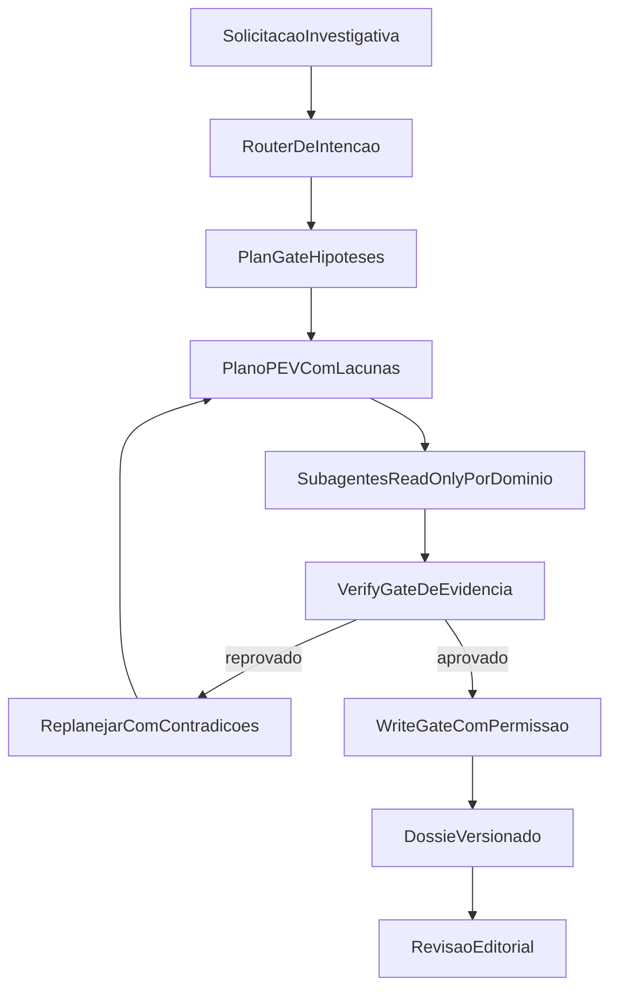

# Reverso Agent - Ideias de Melhoria (Foco Investigacao Jornalistica)

## Escopo e metodo

Este documento consolida melhorias para o `lab/agent` com base em:

- Analise do estado atual em `lab/agent`.
- Inspiracao **apenas** nos projetos:
  - `.agents/inspirations/cline`
  - `.agents/inspirations/learn-claude-code`
  - `.agents/inspirations/opencode`

Objetivo central: aumentar qualidade probatoria, confiabilidade operacional e velocidade de apuracao sem perder governanca editorial.

## 1) O que ja esta solido no Agent Lab

1. Arquitetura modular clara por camadas:
   - CLI e runners (`run-init`, `run-dig`, `run-create-lead`, `run-inquiry`, `run-agent`).
   - Prompts especializados por etapa.
   - Core de contratos, validacoes e loop.
2. Contratos JSON estritos e fluxo de reparo (self-repair) ja presentes em pontos criticos.
3. Gate de evidencia e pre-write validation existentes (base importante para investigacao responsavel).
4. Persistencia orientada a Markdown/JSON com trilha operacional em `filesystem/events`.
5. Cobertura de testes util para parsing, contratos, dedup e validacoes centrais.

## 2) Pontos fracos atuais (priorizados)

### Alta prioridade

1. Sessao global unica de deep-dive em `deep-dive-session.json` (risco de colisao e baixa escalabilidade).
2. Verificacao de evidencia ainda muito heuristica (localizacao textual aproximada pode superestimar confianca).
3. Fallback para resposta negativa quando contrato quebra pode mascarar problema tecnico como "nao ha evidencia".
4. Roteamento do modo `agent` pode sequestrar intencao do usuario quando existe sessao ativa.
5. Conjunto de tools investigativas ainda limitado para inquiry complexa.

### Media prioridade

1. Governanca editorial incompleta (sem revisao formal, trilha de aprovacao e estado juridico/editorial).
2. Nao determinismo em leitura de previews (dificulta reproducibilidade da apuracao).
3. Lacunas de tipagem estrita em partes do processamento documental.
4. Cobertura de testes ainda parcial para concorrencia, falhas prolongadas e fluxo inquiry ponta a ponta.

### Baixa prioridade

1. UX conversacional para cenarios ambiguos pode ficar cansativa em casos longos.
2. Execucao em lote sequencial reduz throughput quando houver multiplos leads.

## 3) Inspiracoes aplicaveis por projeto

## 3.1 Cline -> Confianca operacional e controle humano

Padroes de maior valor para o Reverso:

1. Plan/Act real com gate tecnico (nao apenas instrucao textual).
2. Checkpoints restauraveis por escopo (arquivos, task ou ambos).
3. Hooks de ciclo de vida para politicas de compliance (`PreToolUse`, `PostToolUse`).
4. Auto-approve granular por tool/perfil de risco.
5. Integracao MCP com governanca (timeout, status, politica por servidor).

Aplicacao jornalistica:

- Exigir aprovacao explicita para qualquer escrita em artefato editorial final.
- Manter trilha visivel de decisoes e transicoes de modo (planejamento, coleta, verificacao, redacao).

## 3.2 Learn-Claude-Code -> Evolucao incremental e multiagentes

Padroes de maior valor para o Reverso:

1. Loop de agente simples e estavel com extensao por ferramentas plugaveis.
2. Protocolo de subagentes com isolamento de contexto.
3. Memoria compactada com transcript persistido em disco.
4. Event bus operacional (estado observavel e recuperavel).
5. Evolucao por estagios (complexidade sobe sem quebrar base).

Aplicacao jornalistica:

- Subagentes read-only por dominio (societario, contratos, cronologia, controle publico).
- Lead agent coordenador, com verificacao final centralizada antes de persistir findings.

## 3.3 OpenCode -> Permissoes, guardrails e disciplina de escrita

Padroes de maior valor para o Reverso:

1. Engine de permissao `allow/ask/deny` por capacidade e padrao.
2. Regra read-before-write com validacao de frescor (evita escrita em estado stale).
3. Lock por arquivo e controle de concorrencia na persistencia.
4. Deteccao de doom loop (repeticao de acao sem progresso).
5. Truncation/spill para outputs grandes sem perder auditabilidade.

Aplicacao jornalistica:

- Nao permitir salvar allegation/finding sem releitura recente das evidencias associadas.
- Introduzir permissao especifica para escrita de artefatos criticos (`write_finding`, `write_conclusion`).

## 4) Blueprint-alvo do agente jornalistico

Principios:

1. Evidencia antes de narrativa.
2. Permissao antes de side effect.
3. Planejamento antes de execucao.
4. Reprodutibilidade antes de velocidade.
5. Trilhas de auditoria por padrao.

Fluxo alvo:

Capacidades novas do blueprint:

1. Sessao por investigacao (nao global), com isolamento por `session_id`.
2. Matriz de permissao por tool/capacidade, com defaults seguros.
3. Protocolo de evidencia com campos obrigatorios e verificacao cruzada.
4. Estado editorial explicito por artefato (`draft`, `review`, `approved`, `published`).
5. Logs operacionais padronizados para diagnostico e auditoria.

## 5) Backlog priorizado (P0, P1, P2)

## P0 - Alto impacto e baixo/medio esforco

1. **Sessao isolada por investigacao**
   - Mudar `deep-dive-session.json` para armazenamento por ID/scope.
   - Ganho: elimina colisao e melhora continuidade.

2. **Write gate forte para allegation/finding/conclusion**
   - Exigir evidencia validada + permissao explicita para gravacao critica.
   - Ganho: reduz risco editorial e erro factual.

3. **Fallback de contrato com erro observavel**
   - Substituir fallback silencioso por estado de erro auditavel (`needs_repair`).
   - Ganho: evita falso negativo investigativo.

4. **Deteccao de repeticao sem progresso no inquiry completo**
   - Reforcar parada por no-progress com sugestao de estrategia alternativa.
   - Ganho: menos ciclos improdutivos.

5. **Testes P0 de inquiry ponta a ponta**
   - Cobrir plan -> tools -> evidence gate -> persistencia.
   - Ganho: maior confiabilidade no fluxo mais critico.

## P1 - Impacto estrutural

1. **Matriz de permissao estilo OpenCode**
   - Definir capacidades e regras `allow/ask/deny` por ambiente e comando.
2. **Hooks de compliance estilo Cline**
   - `PreToolUse` e `PostToolUse` para validar politica legal/editorial.
3. **Subagentes por dominio estilo Learn-Claude-Code**
   - Isolamento de contexto e consolidacao por coordenador.
4. **Checkpoints de investigacao**
   - Restaurar estado de artefatos e decisao em pontos de controle.
5. **Governanca editorial no schema Markdown**
   - Adicionar aprovador, data, status, criterio de publicacao e observacoes legais.

## P2 - Escala e sofisticacao

1. **Paralelizacao segura de inquiries em lote**
   - Concurrency limitada com isolamento de sessao e lock.
2. **Motor de verificacao de evidencia mais semantico**
   - Menos dependencia de matching textual simples.
3. **Observabilidade operacional avancada**
   - Metricas por etapa, taxa de retrabalho, tempo por finding.
4. **Politica de dados sensiveis**
   - Redacao/mascaramento para envio ao LLM quando necessario.

## 6) Metricas de sucesso (foco jornalistico)

### Qualidade de prova

1. Percentual de findings com >= 2 evidencias independentes.
2. Percentual de evidencias verificadas sem ambiguidade.
3. Taxa de findings rejeitados na revisao editorial.

### Confiabilidade operacional

1. Taxa de runs interrompidos por erro de contrato.
2. Taxa de regressao por alteracao de tool/prompt.
3. Tempo medio para recuperar de falha sem perda de trilha.

### Produtividade investigativa

1. Tempo medio de `deep-dive` ate primeiro lead viavel.
2. Tempo medio de lead planejado ate inquiry concluida.
3. Proporcao de ciclos uteis vs ciclos sem progresso.

## 7) Mapa de implementacao recomendado (sequencia)

1. P0.1 + P0.2 + P0.3 (fundacao de seguranca editorial).
2. P0.5 em paralelo para blindar regressao.
3. P1.1 + P1.2 (governanca de execucao).
4. P1.3 + P1.4 (escala com controle).
5. P2 conforme maturidade operacional e volume de investigacoes.

