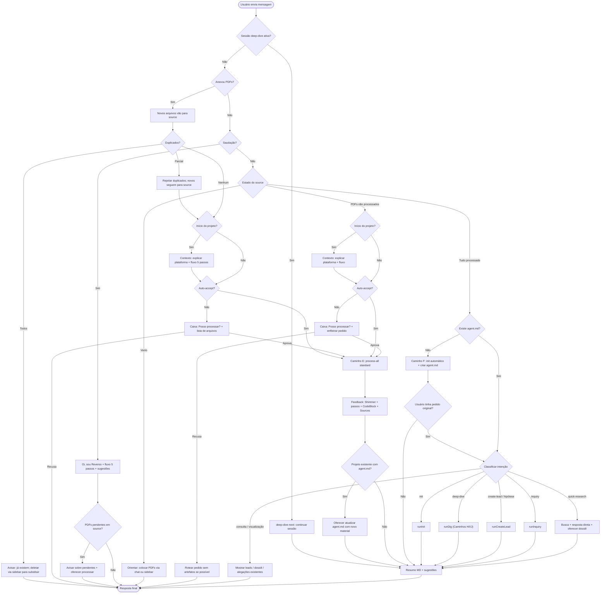

# Agente Reverso — Workflow Design (referência)

**Objetivo:** Mapear **todos os caminhos possíveis** e **workflows** da interação com o agente, para pensar em cada ramo da conversa e garantir cobertura da experiência.

---

## Visão geral: fluxograma de conversas

Cada mensagem do usuário entra no fluxo; o agente depende do **estado** (o que existe em source, o que já foi processado, se há sessão ativa, etc.) e do **tipo de entrada** (saudação, anexo, pergunta, comando implícito).

**Loop de autorreflexão em fila/plano:** Sempre que o agente estiver seguindo uma **fila** ou um **plano** (ex.: processamento + pedido enfileirado, ou execução de um inquiry com vários passos), ele deve fazer um **loop** para tentar resolver aquilo: usar o processo interno existente (autorreflexão, critique-repair, retry, etc.) durante um certo tempo, em vez de falhar logo na primeira tentativa. Só quando **desistir** após esse ciclo é que deve **avisar o usuário** — por exemplo que deu errado, que não conseguiu concluir, ou que precisa de intervenção. Ou seja: tentar resolver em loop antes de reportar falha.

**Fila (queuing):** Se o usuário **pedir algo** (ex.: "me dá contexto") e o agente detectar que há **PDFs não processados**, não executar direto. Perguntar: "Posso processar os arquivos pendentes antes?" → usuário aprova → **fila:** (1) processamento, (2) o que o usuário pediu.

---

## Estados do sistema (contexto da conversa)

| Estado | Descrição | Próximos caminhos possíveis |
|--------|-----------|----------------------------|
| **Sessão deep-dive ativa** | Há sessão em awaiting_plan_decision ou awaiting_inquiry_execution | deep-dive-next com o texto do usuário. |
| **Source vazio** | Nenhum PDF em source | Orientar: colocar PDFs (chat ou sidebar). |
| **Source com PDFs não processados** | Existem PDFs em source, mas não há artefatos (preview, index, metadata) | Perguntar se quer processar; ou enfileirar processamento antes do pedido. |
| **Source processado** | PDFs em source e artefatos gerados | init, deep-dive, create-lead, inquiry, quick-research, consulta, etc. |
| **Previews existem, sem agent.md** | Há pelo menos alguns previews (arquivos já processados), mas não existe `agent.md` (contexto inicial) | Init automático: agente entende que precisa criar contexto, executa init, cria `agent.md`, mostra e explica. |
| **Leads existentes** | Há leads (draft/planned) | inquiry, consulta de leads, etc. |

Sempre que o usuário conversar, o agente **conferir** quais arquivos já foram processados; se houver PDFs sem artefatos, **perguntar** se quer processar (ou enfileirar antes do pedido).

---

## Referência: início do projeto vs já iniciou

Para saber se a pessoa está **no começo** do projeto ou **já iniciou**, usar:

| Condição | Significado |
|----------|-------------|
| **Sem histórico de conversa** e **sem `agent.md`** (init ainda não foi feito) | **Início do projeto** — tratar como primeira experiência. |
| **Tem conversa no histórico** ou **tem `agent.md`** (init já foi feito) | **Já iniciou** — pode ir direto ao ponto. |

Quando for **sugerir processar os arquivos** (a pessoa já anexou PDFs em source mas ainda não processou): se for **início do projeto**, **antes** de perguntar "Quer que eu processe?", dar **contexto e explicar como a plataforma funciona** da mesma forma que na saudação (quem é o Reverso, fluxo em 5 passos, o que o processamento faz). **Depois** sugerir processar. Se já iniciou, pode ir direto à sugestão de processar.

---

## Regras gerais (todas as partes do timeline)

- **Auto-accept (permissão):** Quando o usuário tiver **auto-accept ativo**, o agente **não pede permissão** em nenhum caso — executa as ações previstas no workflow diretamente. Quando o **auto-accept estiver desligado**, o agente **pede permissão** nos casos já desenhados neste workflow (ex.: processar arquivos, alterar `agent.md`, approval de tools, etc.).
- **Quando mostrar Sources (interface):** Usar a lista **Sources** sempre que um **arquivo foi usado** para pesquisa, para contexto, para juntar informação (ex.: na hora de fazer leads, na hora de tomar decisões) — ou seja, fontes **consultadas** como entrada. **Não** mostrar como Sources quando o arquivo foi **criado ou manipulado** pelo agente (ex.: dossiês, previews, artefatos gerados); nesses casos não precisam aparecer na lista de Sources.
- **Chain of Thought (CoT):** Usar o CoT que **vem do modelo** (API). Interface exibe com **ChainOfThought** (AI Elements). Não inventar passos.
- **Feedback em texto:** Sempre dizer **em texto** o que o agente **vai fazer** antes de executar (ex.: "Vou processar os 3 arquivos na pasta source.").
- **Resumo final e próximos passos:** Ao **final** de cada fluxo: **resumo em Markdown** do que foi feito + **sugestões** do que fazer em seguida.
- **Shimmer:** Durante geração de textos longos (preview, réplica, etc.): mostrar com **Shimmer** para não poluir a tela; quando terminar, mostrar resultado em **CodeBlock** ou **Artifact**.
- **Verificação de arquivos processados:** A cada conversa, conferir o que já está processado. PDFs em source sem artefatos → perguntar se quer processar (ou enfileirar processamento antes do pedido).
- **Contexto antes de sugerir processar (início do projeto):** Se a pessoa já anexou PDFs e ainda não processou, e estiver no **início do projeto** (sem histórico de conversa e sem `agent.md`), **antes** de sugerir processar os arquivos dar **contexto e explicar como a plataforma funciona** (mesmo conteúdo da saudação: quem é o Reverso, fluxo em 5 passos). Só depois sugerir: "Quer que eu processe esses arquivos e crie os resumos?" Se já tiver histórico ou `agent.md`, ir direto à sugestão de processar.
- **Após init (só init, sem pedido adicional):** Quando o agente fez **apenas** o init e o usuário não pediu nada além disso, ao final orientar que o **próximo passo** seria fazer uma **exploração da base (deep dive)**; dizer que o usuário pode pedir isso em texto ou usar o comando (ex.: `/deep-dive`). Em qualquer caso em que o init for feito (pedido ou automático), mencionar que também existe o comando **/init** para gerar ou atualizar o contexto.
- **Atualização do agent.md:** O arquivo `agent.md` pode ser atualizado pelo comando "update agent instructions" ou **verbalmente**: sempre que o usuário disser que quer explicar melhor o que está fazendo, qual é a investigação, que quer dar mais contexto, ou quando descrever o que está fazendo, o agente entende que deve atualizar esse arquivo. **Pedir permissão** antes de alterar o `agent.md` quando entender que algo precisa ser adicionado ou modificado.
- **Upload em projeto existente (novos PDFs):** Quando o usuário adicionar mais PDFs a um projeto que **já tem `agent.md`**: processar os novos arquivos e, ao final, **oferecer atualizar o `agent.md`** com o novo material. Com **auto-accept**, atualizar diretamente; sem auto-accept, **pedir permissão** antes.

---

## Caminhos detalhados

### Caminho A — Saudação (oi, tudo bem?)

- **Gatilho:** usuário fala "olá", "tudo bem?", "oi", "como vai?".
- **Ação:** Resposta com "Oi, eu sou o Reverso", detecção de idioma, explicação do agente jornalístico e do **fluxo em 5 passos** (processar fontes → init → deep-dive → create-lead / inquiry → allegations/findings). Ao final: resumo em Markdown do que "você pode fazer comigo" + sugestões.
- **State-aware:** Após a introdução, o agente **verifica o estado do source**. Se houver **PDFs pendentes** (não processados), avisar e **oferecer processar**. Se o source estiver **vazio**, orientar a colocar PDFs. Se tudo estiver ok (processado + `agent.md`), as sugestões já direcionam para deep-dive, leads, etc.
- **Componentes:** Message, MessageResponse; opcional Suggestions; ChainOfThought se o modelo enviar.

---

### Caminho B — Estado vazio (sem PDFs em source)

- **Gatilho:** usuário conversa e não há nenhum PDF em source.
- **Ação:** Dizer que o primeiro passo é colocar PDFs em source. Explicar **duas formas:** (1) arrastar PDF(s) no chat — vão para source; (2) barra lateral → Source → upload.
- **Componentes:** Message, MessageResponse; Attachments se houver anexos.

---

### Caminho C — Usuário anexa PDF(s) no chat

1. **Arquivos → source** automaticamente.
2. **Verificação de duplicados:** Para cada arquivo, checar se já existe em source (mesmo nome). Arquivos duplicados são **rejeitados** — avisar o usuário que precisa ir na barra lateral > Sources > Actions e deletar o arquivo existente antes de enviar novamente. Arquivos **não duplicados** seguem normalmente para source.
3. **Se todos forem duplicados:** avisar e encerrar (não há novos arquivos para processar).
4. **Se início do projeto** (sem histórico + sem `agent.md`): dar **contexto** — explicar como a plataforma funciona (Reverso, fluxo em 5 passos), **depois** seguir. **Se já iniciou:** ir direto ao passo seguinte.
5. **Processar:** Com **auto-accept** ativo, processar diretamente (sem perguntar). Sem auto-accept → **Caixa de permissão:** "Posso processar esses arquivos?" + lista → aprovar → **process-all** (standard). Se recusar, encerrar.
6. **Durante o processamento:** fila em detalhes, feedback em texto, Shimmer, por arquivo: CodeBlock/Artifact + Sources (ver Caminho E).
7. **Pós-processamento (projeto existente):** Se o projeto já tinha `agent.md`, oferecer **atualizar o agent.md** com o novo material (auto-accept: atualizar direto; sem auto-accept: pedir permissão).
8. **Resumo final:** Markdown do que foi feito + sugestões (init, deep-dive, etc.).
- **Componentes:** Confirmation/ConfirmationDisplay, Shimmer, Tool/ToolCallDisplay, CodeBlock/Artifact, Sources, Message.

---

### Caminho D — Source tem PDFs não processados (sem anexo nesta mensagem)

- **Gatilho:** usuário pergunta algo ou só conversa; o agente vê que há PDFs em source sem artefatos.
- **Ação:** Se **início do projeto** (sem histórico + sem `agent.md`): primeiro dar **contexto** — explicar como a plataforma funciona (Reverso, fluxo em 5 passos). Depois perguntar se quer processar esses arquivos. Se **já iniciou**, perguntar direto se quer processar. Com **auto-accept**, processar direto sem perguntar. Sem auto-accept → permissão → se sim, mesma sequência que Caminho E. Se o usuário fez um **pedido** que exige artefatos, enfileirar: (1) processamento, (2) o que ele pediu. Se recusar processar, tentar rotear o pedido sem artefatos se possível.
- **Componentes:** Confirmation, depois os mesmos de E.

---

### Caminho E — Processamento em si (execução)

- **Entrada:** Usuário aprovou processar (veio de C ou D) ou auto-accept ativo.
- **Ações:** processSourceTool com `process-all`, modo `standard`. Mostrar fila, passos por arquivo, Shimmer durante geração, resultado em CodeBlock/Artifact, Sources por PDF.
- **Pós-processamento (projeto existente):** Se o projeto já tinha `agent.md` (usuário adicionou mais PDFs a um projeto em andamento), ao final do processamento **oferecer atualizar o `agent.md`** com o novo material processado. Com auto-accept, atualizar diretamente; sem auto-accept, pedir permissão antes.
- **Saída:** Resumo em Markdown + sugestões.
- **Componentes:** Shimmer, Tool/ToolCallDisplay, CodeBlock/Artifact, Sources, Message, Confirmation (quando oferecer atualizar agent.md).

---

### Caminho F — Tem previews, sem agent.md: init automático

- **Gatilho:** usuário já tem (pelo menos alguns) arquivos com preview/artefatos, começa a conversar, e **não existe `agent.md`** (contexto inicial ainda não foi feito). O usuário pede algo ou o agente entende que precisa de contexto.
- **Ação:**
  1. **Explicar em texto:** Antes de fazer o que a pessoa pediu, o agente precisa entender o contexto da investigação e do material. Vai dar uma olhada no que existe e criar um arquivo `agent.md` com uma visão geral da investigação.
  2. **Executar init** (runInit): streaming do entendimento, depois criar o arquivo `agent.md`.
  3. **Resumir para o usuário** o que foi adicionado/escrito.
  4. **Mostrar o arquivo** via **Artifact** ou **CodeBlock** (conteúdo do `agent.md`).
  5. **Explicar em texto:** Criou esse arquivo; ele é **inserido/carregado toda vez que uma conversa começa**, para o agente entender melhor o contexto da investigação. Mencionar que também existe o comando **/init** para isso.
  6. **Explicar como atualizar:** O usuário pode usar o comando para pedir atualização ("update agent instructions") ou **verbalmente**: sempre que disser que quer explicar melhor o que está fazendo, qual a investigação, ou que quer dar mais contexto, ou quando descrever o que está fazendo, o agente entende que deve atualizar o `agent.md`. E o agente **pede permissão** antes de alterar o arquivo quando entender que algo precisa ser adicionado.
- **Continuidade:** Se o usuário **tinha um pedido original** (ex.: "quero investigar X"), depois do init o agente **continua** para o roteamento por intenção (Caminho G) e executa o que foi pedido. Se **só foi feito o init** e o usuário não pediu nada além disso: orientar que o próximo passo seria fazer uma **exploração da base (deep dive)** e que pode pedir isso em texto ou usar o comando (ex.: `/deep-dive`).
- **Componentes:** Message, Shimmer (durante geração), CodeBlock ou Artifact (agent.md), Confirmation quando for atualizar o arquivo depois.

---

### Caminho G — Source já processado e tem agent.md: roteamento por intenção

- **Gatilho:** source com artefatos **e** existe `agent.md`; usuário pede algo.
- **Ação:** Classificar intenção e chamar o runner ou fluxo correspondente:

| Intenção | Destino | Referência |
|----------|---------|------------|
| init | runInit | Caminho F / re-init |
| deep-dive | runDig | Caminhos H/I/J |
| create-lead / hipótese | runCreateLead | Seção: criar lead |
| inquiry | runInquiry | Seção: inquiry |
| quick-research | busca + resposta | Seção: quick research |
| consulta / visualização | mostrar dados existentes | Caminho K |

Ao final de cada fluxo: resumo + sugestões.

---

## Cenário: explorar fontes / deep dive / pesquisa investigativa (sem lead)

Quando o usuário pede para **explorar as fontes**, **explorar os documents/sources**, **fazer um deep dive** ou **fazer uma pesquisa investigativa** e **não especifica nenhum lead** — e em especial quando **ainda não tem leads** —, o agente faz um **deep research** (deep dive). Três sub-cenários:

### Caminho H — Usuário pede explorar e já tem previews, mas não tem init

- **Gatilho:** primeira coisa que o usuário faz é pedir para explorar as fontes; existem previews (arquivos processados), mas **não existe `agent.md`**.
- **Ação:** Fila: (1) fazer **init** (criar contexto inicial — Caminho F), (2) depois fazer a **exploração (deep dive — Caminho J)**. Explicar isso em texto e executar em ordem.

### Caminho I — Usuário pede explorar/investigar e não tem nada (nem arquivos)

- **Gatilho:** usuário pede para explorar, fazer investigação sobre um assunto, e **não tem nada** — nem arquivos em source.
- **Ação:**
  1. Dizer que o agente **só trabalha com PDFs como fonte** e que é para **anexar os PDFs** (chat ou sidebar).
  2. Quando os PDFs estiverem em source: **fila** em que o agente vai (1) **processar os documentos** um a um, com feedback (todo o processo já descrito em Caminho E: Shimmer, passos, CodeBlock/Artifact, Sources), (2) **init do projeto** — explicar que precisa criar o documento inicial de contexto (Caminho F), (3) **deep dive** e exploração (Caminho J).
  3. Executar a fila e dar feedback em cada etapa.

### Caminho J — Deep dive em si (já tem previews e agent.md)

- **Gatilho:** usuário pede explorar / deep dive / pesquisa investigativa, sem especificar lead; já tem previews e `agent.md`.
- **Ação:** Executar runDig (deep dive). Ver abaixo a **interface e o fluxo do Deep Dive**.

---

## Cenário: consulta e visualização de dados existentes

### Caminho K — Consulta e visualização

- **Gatilho:** usuário pede para **ver**, **listar** ou **consultar** dados que já existem — leads, dossiês, alegações, findings, fontes processadas, timeline, etc. Exemplos: "me mostra os leads", "quero ver o dossiê da empresa X", "lista as alegações", "quais fontes já foram processadas?", "o que eu tenho até agora?".
- **Ação:** Buscar e apresentar os dados existentes de forma organizada, **sem iniciar trabalho novo**. Resposta direta com os dados solicitados. Se os dados não existirem (ex.: "me mostra os leads" mas não há leads), informar e sugerir o caminho para criá-los (ex.: "Ainda não há leads. Posso fazer um deep dive para sugerir alguns.").
- **Tipos de consulta:**
  - **Leads:** listar leads existentes com status (draft, planned, em andamento, concluído).
  - **Dossiê:** mostrar conteúdo do dossiê de uma entidade (pessoa, empresa, etc.) via CodeBlock/Artifact.
  - **Alegações / findings:** listar alegações com seus findings e status (aceito, recusado, verificado, inverificado).
  - **Fontes processadas:** listar PDFs e status de processamento (tem preview, metadata, etc.).
  - **agent.md / contexto:** mostrar o contexto atual da investigação.
- **Componentes:** Message, MessageResponse; CodeBlock ou Artifact (para dossiês, agent.md); componente de leads (para listar leads); componente de alegações/findings; Sources (quando listar fontes).

---

## Deep Dive — interface e fluxo

**Explicar ao usuário como o Deep Dive é feito:**

- O agente vai **selecionar lateralmente algumas fontes** (previews) e começar a **iterá-las**, fazer **reflexões** e ver **como se conectam** e se há **indícios**.
- Ele vai **selecionar os previews** que vai usar nessa busca.
- Depois faz uma **fila (queue)** que mostra a **interação com os documentos** conforme projetado no agente hoje (streaming, passos, reflexões).

**Relatório interno:**

- O **relatório** que o agente gera hoje no deep dive **não vai para o usuário em bruto** — é para ajudar o agente e vai para o **contexto**. Para o usuário, o agente **só resume** e diz **o que descobriu**.

**Leads sugeridos (1 a 3):**

- **Sempre conferir** se já existe um **lead parecido** (por título, ideia ou escopo) antes de sugerir novos leads; evitar duplicar ou sobrepor leads existentes.
- Mostrar **de um a três leads** sugeridos. Quando o agente gera esses leads, ele **já faz o planejamento do inquiry** para cada um — não existe passo separado de "pedir para planejar"; o usuário só dispara a **execução da investigação (inquiry)**.
- **Componente:** *(Observação: talvez seja necessário criar ou adaptar um componente específico para exibir os leads.)* Por ora, usar o componente **Plan** (AI Elements) para **cada lead**, com duas ações:
  - Botão **"Inquiry"** (ou "Investigar"): ao clicar, o agente executa a investigação (inquiry) para achar findings e allegations (o planejamento já foi feito na geração dos leads).
  - Botão **"Rejeitar lead"**.
- **Texto final para o usuário:** Explicar que pode **clicar no botão Inquiry** de um lead para executar a investigação (findings e allegations). Pode também **escrever** para fazer todos de uma vez, ou **pedir para fazer a busca de novo** e descartar esses leads, ou **pedir para alterar os leads** do jeito que quiser.

**Pós-rejeição de leads:**

- Se o usuário **rejeitar todos** os leads sugeridos pelo deep dive: o agente pergunta se quer **fazer um novo deep dive** com foco diferente, ou se quer **propor a própria hipótese** (criar lead manualmente). A sessão de deep dive é encerrada e o agente fica disponível para o próximo pedido.
- Se o usuário **rejeitar alguns** e aceitar outros: os rejeitados são descartados e os aceitos seguem para inquiry normalmente.
- Se o usuário pedir para **descartar todos e refazer a busca**: iniciar um novo deep dive; a sessão anterior é substituída pela nova.

---

## Cenário: usuário traz hipótese, ideia ou pedido de investigação (criar lead)

Quando o usuário **não está** em um processo de research/deep dive, mas vem com a **própria hipótese**, **ideia** ou **pedido de investigação** — por exemplo: "eu queria investigar isso", "eu acredito nisso", "quero encontrar X", "quero fazer uma investigação sobre Y" —, o agente trata como **criação de lead a partir da fala do usuário**.

**Fluxo:**

1. **Analisar** o que o usuário disse e **verificar se já existe** um lead que corresponda (mesmo tema, mesma ideia, mesmo escopo).
2. **Se não existir:** criar um lead com base no que ele falou. Explicar em texto: "Com base no que você falou, podemos criar este lead e fazer este planejamento." Mostrar o lead e o planejamento (ex.: componente Plan ou equivalente).
3. **Pedir aprovação ou alteração:** o usuário pode **aprovar** (botão para seguir o planejamento / executar inquiry) ou **pedir para alterar** (escrever o que quer mudar).
4. Sempre que houver **tom de pista, de investigação** — "eu quero encontrar", "eu quero fazer alguma coisa", "quero investigar" —, fazer esse processo: criar o lead (se não existir), fazer o planejamento, pedir para o usuário alterar ou apertar o botão para seguir o planejamento (inquiry).

**Resumo:** Criar lead a partir da ideia do usuário → verificar se já existe algo parecido → se não, criar + planejar → mostrar e pedir aprovar ou alterar → botão para seguir o planejamento (inquiry).

---

## Inquiry — feedback visual e resultado

Quando a pessoa pede para fazer o **inquiry** de um lead, o agente dá **feedback visual** e segue o plano em fila, mostrando o passo a passo. Ao terminar, retorna conclusão, alegações e (quando aplicável) nova estratégia ou ausência de alegações. Em inquiry múltiplo (vários leads), usa fila e só interrompe o usuário em alguns casos; no fim, resumo do que foi encontrado.

### Durante o inquiry (um lead)

- **Início:** Dar feedback em texto: vai começar o processo, vai seguir a fila conforme o plano.
- **Fila / passo a passo:** Fazer **queuing** (fila) e ir **seguindo o plano como checklist** — marcar e mostrar o que está sendo feito a cada passo e dar feedback ao usuário (ex.: "Executando passo 1…", "Consultando fontes…").
- **Conclusão:** Quando terminar, fazer a **conclusão**, retornar para o usuário, dizer que **atualizou o lead** e **mostrar as alegações** que fez.
- **Alegações:** Usar um **componente específico** para exibir **alegações**; dentro de cada alegação, mostrar os **findings relacionados**. O usuário pode **aceitar ou recusar** cada alegação. Para **cada finding**, o usuário pode: **marcar como verificado (checked)**, **recusar** (dizer que não é fato) ou **deixar como inverificado**. Ter isso na interface desde o início.
- **Sugestões após alegações e findings:** Recomendar que o **próprio usuário confira** as informações e faça o **aceite ou recusa das alegações** e **verifique os findings**. Pode sugerir que o usuário **peça ajuda** para um **passo a passo de como verificar os findings**: o agente então **passa os arquivos** que o usuário tem que abrir e **aproximadamente a localização das páginas** em que deve checar as informações, para o usuário validar. Também sugerir: fazer uma **nova exploração (Deep Dive)** e recomeçar o processo de achar leads, ou **propor as próprias ideias investigativas** do usuário.

### Mudança de estratégia durante o inquiry

- Quando, **durante o inquiry**, o agente perceber que precisa **mudar a estratégia de busca** ou **adicionar novas etapas**: avisar o usuário ou **retornar o lead com o novo planejamento**, dizer que **não chegou a uma conclusão** mas acha que pode seguir um **caminho diferente**, e **pedir para apertar Inquiry de novo** para ir atrás das informações.

### Inquiry sem resultado (pesquisa suficiente)

- Quando o **inquiry não tem nenhum resultado** e o agente está **confiante** de que já fez a pesquisa necessária para chegar às conclusões: **avisar** que não há **nenhuma alegação pertinente** e que vai **manter o lead como organizado** apenas para não voltar a fazer esse tipo de investigação de novo (evitar refazer o mesmo inquiry).

### Vários inquiries ao mesmo tempo (ex.: os 2 ou 3 sugeridos no deep dive)

- Quando o usuário pede para fazer **vários inquiries ao mesmo tempo** (ex.: os dois ou três leads sugeridos na fase de deep dive): fazer uma **fila** pensando no **loop completo** de todo o processo dos três (ou N) leads.
- **Só em alguns casos** voltar para o usuário no meio (ex.: quando precisar mudar estratégia, pedir aprovação ou mostrar novo planejamento); senão, continuar passo a passo até **conclusão final**.
- No final: **resumo** do que foi encontrado em todos os leads e, quando aplicável, mostrar alegações/findings por lead.

---

## Distinção: quick research vs pedido investigativo (lead)

- **Quick research:** O usuário quer **perguntas e respostas específicas** com base no source — "quem é o presidente da empresa X", "o que o documento Y diz sobre Z", "qual o valor do contrato A". Resposta direta + opção de atualizar/criar dossiê. Ver cenário abaixo.
- **Pedido investigativo (virar lead):** Quando o usuário pede algo **investigativo** — "quero investigar se existe superfaturação nas tabelas", "quero comparar todas as tabelas de valores de obra", "quero saber como as pessoas se relacionam", "qual contrato recebeu mais dinheiro" — isso é **lead**: criar um plano, fazer o planejamento do inquiry para isso, **pedir para o usuário aceitar** (ou alterar) e depois executar o inquiry. Ou seja, fluxo **criar lead a partir da ideia** → plano → aprovar → inquiry. Não é quick research; é pesquisa que exige planejamento e passos estruturados.

---

## Cenário: quick research (perguntas e respostas específicas)

**Quick research** é **sempre** quando o usuário quer **perguntas e respostas específicas** com base no source — sem pedir uma investigação estruturada (essa vira lead).

**Fluxo:** (1) Fazer a busca nos documentos, (2) juntar as informações, (3) **responder ao usuário** de forma direta, (4) **perguntar se pode atualizar o dossiê** (daquela pessoa, empresa, etc.) ou **criar um dossiê** com o que encontrou, (5) com **auto-accept**: executar; sem auto-accept: **pedir aprovação** e só então fazer.

**Exemplo:** "Quem é o presidente da empresa X?" → busca → responde → "Posso atualizar o dossiê dessa pessoa (ou criar um dossiê)?" → executa ou pede ok.

**Resumo:** Pergunta específica (quem é, o que diz, qual valor, etc.) → responder → oferecer atualizar/criar dossiê → executar (auto-accept) ou pedir aprovação.

---

## Continuidade de sessão e persistência de estado

O agente mantém estado entre mensagens. Comportamento esperado para cada tipo de sessão:

### Deep-dive session ativa

- Quando há uma **sessão deep-dive em andamento** (`awaiting_plan_decision` ou `awaiting_inquiry_execution`), a próxima mensagem do usuário entra pelo topo do fluxograma e é encaminhada via **deep-dive-next** — continuando a sessão existente em vez de iniciar uma nova classificação de intenção.
- A sessão é **encerrada** quando: (a) o usuário rejeita todos os leads e não quer refazer, (b) o inquiry dos leads aceitos é concluído, ou (c) o usuário pede explicitamente para sair/mudar de assunto.

### Leads em andamento

- Leads criados (por deep dive ou por hipótese do usuário) **persistem** entre mensagens. O usuário pode voltar a eles a qualquer momento — via Caminho K (consulta) ou pedindo para executar inquiry em um lead específico.
- Leads com inquiry concluído (com ou sem alegações) ficam armazenados e podem ser consultados.

### Pedido enfileirado

- Quando o agente faz uma **fila** (ex.: processar PDFs primeiro, depois executar o pedido), o pedido original do usuário é preservado e executado na sequência. O agente avisa em texto quando está passando de uma etapa para outra (ex.: "Processamento concluído. Agora vou atender o que você pediu.").

### Histórico de conversa

- O **histórico de conversa** determina se o projeto é novo ou já iniciado (ver seção "início do projeto vs já iniciou"). Conversas anteriores ficam registradas e influenciam o nível de contexto que o agente dá ao usuário.

---

## Conexão com o agente (resumo)

- **Processamento:** `processSourceTool` com `subcommand: 'process-all'`, `mode: 'standard'`. CLI: `doc-process process-all --mode standard`.
- **Approval:** `lab/agent/src/server/` — approval-gate + `POST /api/approval/:requestId`.
- **SSE:** `tool-call`, `tool-result`, `text-delta`, `status`.
- **Pipeline:** `lab/agent/src/tools/document-processing/` → `preview.md`, `index.md`, `metadata.md` em `.artifacts`.

---

## Componentes de interface (mapeamento rápido)

| Expectativa              | Componente |
|--------------------------|------------|
| Resposta do assistente   | Message, MessageContent, MessageResponse |
| Sugestões no vazio       | Suggestion, Suggestions |
| Raciocínio do modelo     | ChainOfThought |
| Anexos no input          | Attachments |
| Confirmação (aprovar/rejeitar) | Confirmation, ConfirmationDisplay |
| Processando/pensando     | Shimmer |
| Chamada/resultado de tool| Tool, ToolCallDisplay |
| Arquivo gerado (preview, etc.) | CodeBlock, Artifact |
| Fontes consultadas       | Sources |
| Lead sugerido (com Inquiry / Rejeitar) | Plan (AI Elements) ou componente específico, com botões customizados |
| Alegações (com findings relacionados)  | Componente específico: alegação (aceitar/recusar); por finding: verificado / recusar (não é fato) / inverificado |
| Dados existentes (consulta) | CodeBlock/Artifact (dossiê, agent.md); componente de leads; componente de alegações |
| Fila / progresso de execução | Queue (AI Elements), checklist de passos |

---

*Documento vivo: adicionar novos fluxos conforme surgir necessidade, mantendo as regras gerais e a consistência entre fluxograma e caminhos detalhados.*
