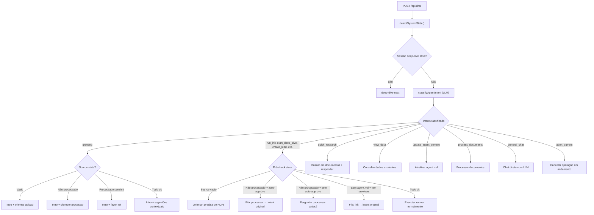
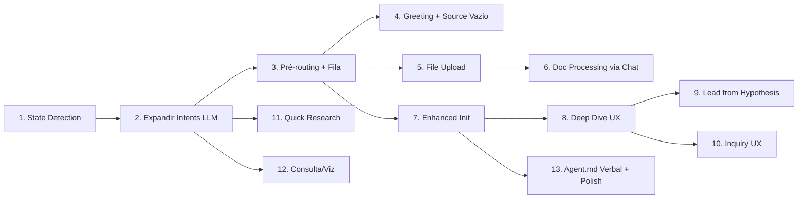

# Workflow Master Plan — Agente Reverso

> Plano mestre para alinhar a experiência do agente + interface com o workflow design (`agente-workflow-design.md`).
> Cada etapa corresponde a um ciclo `plan -> execute-plan`.

---

## 1. Gap Analysis

### O que já existe (implementado nas etapas 1-16 + feedback UI)

**Backend (`lab/agent/src/`):**
- Server HTTP com SSE (porta 3210), 5 endpoints: `GET /api/health`, `GET /api/context`, `GET /api/session`, `POST /api/chat`, `POST /api/approval/:id`
- `decideAgentRoute` com classificação de intents via LLM (init, deep_dive, create_lead, execute_inquiry, plan_leads, ask_clarify, deep_dive_next)
- `UiFeedbackController` como interface primária de feedback, com implementação SSE (`SseUiFeedback`) e CLI (`CliUiFeedback`)
- Runners reais conectados: `runInit`, `runDig`, `runDeepDiveNext`, `runCreateLead`, `runInquiry`, `planLeads`, `executeInquiryBatch`
- `RoutingContext` com `runtime`, `session`, `hasAgentContext`, `leads`
- `loadSourceCheckpoint` / `scanSourceFiles` para status de processamento de PDFs (existe mas não é usado no routing)
- `processSourceTool` para processamento de documentos (existe mas não acessível via chat)
- `shouldCaptureInvestigationContext` para detectar contexto verbal (existe no CLI, não conectado à interface)
- Persistência de sessão de chat, contexto LLM com janela deslizante

**Frontend (`lab/agent/interface/src/`):**
- AI Elements: Conversation, Message, AssistantMessage, Loader, Shimmer, Reasoning, ChainOfThought, Plan, Queue, Tool, Confirmation, Sources, CodeBlock, Context, PromptInput, Suggestions
- Zustand store com `streamingMessage` isolada, `StreamPhase`, `ToolLifecycle`, `TraceSteps`
- `HttpAgentTransport` + `IpcAgentTransport` (stub)
- `ChatHeader` com modelo, stage, leads, auto-approve toggle
- `ChatErrorBoundary`

**Eventos SSE existentes:**
`route-decision`, `status`, `text-delta`, `text-done`, `reasoning`, `plan`, `plan-step-update`, `tool-call`, `tool-result`, `approval-request`, `source-reference`, `session-update`, `token-usage`, `step-start`, `step-complete`, `step-error`, `error`, `done`

### O que falta (gaps mapeados do workflow design)

| # | Gap | Caminhos do workflow | Impacto |
|---|-----|---------------------|---------|
| 1 | Sem detecção de estado do source antes de rotear | A, B, C, D, E, F | Agente não sabe se tem PDFs pendentes |
| 2 | Sem upload de PDFs pela interface | C | Usuário não consegue adicionar fontes pelo chat |
| 3 | Sem processamento de documentos via interface | D, E | pipeline `processSourceTool` existe mas não é rota de chat |
| 4 | Sem fluxo de saudação/primeiro uso | A | Sem explicação da plataforma para novos usuários |
| 5 | Sem sistema de fila (queuing) | D, H, I | Não encadeia operações (processar → init → deep-dive) |
| 6 | Init não mostra agent.md como Artifact | F | Usuário não vê o que foi gerado |
| 7 | Init não continua para pedido original | F | Se pediu deep-dive e não tem init, faz init mas não continua |
| 8 | Deep Dive não mostra fontes selecionadas | J | Sem visibilidade do que está sendo analisado |
| 9 | Leads sugeridos sem botões de ação | J | Sem Inquiry/Rejeitar interativo |
| 10 | Sem fluxo pós-rejeição de leads | J | Sem orientação se todos rejeitados |
| 11 | Sem rota quick-research | G | Perguntas específicas não buscam nos documentos |
| 12 | Sem consulta/visualização de dados | K | Não lista leads, dossiês, alegações |
| 13 | Sem componentes de alegações/findings | — | Sem aceitar/recusar/verificar |
| 14 | Suggestions estáticas | todos | Não mudam conforme estado |
| 15 | Sources não distinguem consultadas de criadas | — | Mostra tudo como Source |
| 16 | Sem trigger verbal para agent.md | — | `shouldCaptureInvestigationContext` desconectado |
| 17 | Sem pós-processamento: oferecer atualizar agent.md | C, E | Novos PDFs não triggam atualização |
| 18 | Sem cancel mid-stream | todos | Não há como parar operação em andamento |
| 19 | Sem retry estruturado para falhas de LLM | todos | Falha transiente derruba a operação inteira |
| 20 | Sem doom loop detection no agent loop | inquiry | Loop infinito de tool calls idênticos |

---

## 2. Decisão de Arquitetura: LLM-driven routing

**Decisão principal:** Toda classificação de intenção — incluindo saudação, quick-research, consulta, update de contexto — é feita pelo LLM, não por heurísticas. Isso garante suporte multi-idioma e nuance natural.

O `classifyAgentIntent` atual já usa LLM como fallback. A mudança é:
1. **Expandir os intents** do agent-router para cobrir os novos caminhos
2. **Adicionar estado do source** ao prompt do LLM para que ele tome decisões state-aware
3. **O LLM decide** se é greeting, se precisa processar, se é quick-research, etc. — usando o estado do sistema como contexto

### Intents atuais vs novos

| Intent atual | Mantém? | Observação |
|---|---|---|
| `continue_session` | Sim | — |
| `start_deep_dive` | Sim | — |
| `run_init` | Sim | — |
| `request_context` | Sim | — |
| `describe_investigation` | Sim | Pode triggrar update de agent.md |
| `create_lead` | Sim | — |
| `plan_inquiry` | Sim | — |
| `run_inquiry` | Sim | — |
| `ask_clarify` | Renomeado | → `general_chat` (mais claro) |
| `unknown` | Sim | Fallback |

| Intent novo | Descrição | Caminho do workflow |
|---|---|---|
| `greeting` | Saudação, boas-vindas, "oi", "como funciona" | A |
| `quick_research` | Pergunta específica que busca nos documentos | G (quick-research) |
| `view_data` | Consulta/visualização de dados existentes | K |
| `update_agent_context` | Usuário quer dar/alterar contexto da investigação | — |
| `process_documents` | Usuário pede para processar documentos explicitamente | D, E |
| `abort_current` | Usuário quer cancelar operação em andamento ("para", "cancela") | todos |

### Novo fluxo de routing



**Ponto-chave:** O LLM recebe o estado do source no prompt e decide. Se o source está vazio e o usuário pediu deep-dive, o LLM pode retornar `start_deep_dive` — mas o servidor faz o **pré-check de estado** e cria a fila necessária (orientar upload → processar → init → deep-dive). A inteligência de "o que o usuário quer" fica no LLM; a lógica de "o que precisa acontecer antes" fica no servidor.

---

## 3. Mudanças de Arquitetura

### 3.1 Backend: `state-detector.ts` (novo)

Arquivo: `lab/agent/src/server/state-detector.ts`

```typescript
interface SystemState {
  sourceEmpty: boolean
  unprocessedFiles: { docId: string; fileName: string }[]
  processedFiles: { docId: string; fileName: string }[]
  failedFiles: { docId: string; fileName: string; error?: string }[]
  totalSourceFiles: number
  hasAgentContext: boolean
  isFirstVisit: boolean
  hasDeepDiveSession: boolean
  sessionStage?: string
  leads: LeadSummary[]
  hasPreviewsWithoutInit: boolean
  lastSessionTimestamp?: string  // ISO8601 da última conversa
}
```

Usa `loadSourceCheckpoint` + `scanSourceFiles` (já existem em `source-checkpoint.ts` e `source-indexer.ts`) para determinar o estado. Combinado com `hasAgentContext`, `leads` e session do `RoutingContext` atual.

- `failedFiles`: arquivos que constam no checkpoint com status `failed` — expostos para que o agente possa oferecer reprocessamento
- `lastSessionTimestamp`: carregado do `chat-session.ts` para saber se é retorno (hoje vs. semanas atrás)

### 3.2 Backend: Expandir `agent-router.ts`

Adicionar novos intents ao prompt do LLM (`buildAgentRouterSystemPrompt`):
- `greeting` — "oi", "hello", "como funciona", "what is this"
- `quick_research` — perguntas factuais sobre conteúdo dos documentos
- `view_data` — "mostra os leads", "lista as alegações", "quero ver o dossiê"
- `update_agent_context` — "estou investigando X", "quero adicionar contexto"
- `process_documents` — "processa os arquivos", "pode processar os PDFs"
- `general_chat` — conversa geral sem intenção investigativa clara (substitui `ask_clarify`)
- `abort_current` — "para", "cancela", "stop", "esquece"

Adicionar estado do source ao prompt (`buildAgentRouterUserPrompt`):
```
Source state: empty | 3 unprocessed files | all processed (5 files) | 2 failed files
Has agent context (agent.md): yes | no
Is first visit (no chat history, no agent.md): yes | no
```

### 3.3 Backend: Refatorar `chat.ts` — pré-routing state-aware

Após classificar intent, `chat.ts` faz pré-checks baseados no `SystemState`:

1. **Intent `abort_current`** → chamar `POST /api/cancel` internamente e confirmar
2. **Source vazio + intent que precisa de dados** → responder orientando upload (LLM gera texto)
3. **PDFs não processados + auto-approve on** → fila automática: processar → intent original
4. **PDFs não processados + auto-approve off** → perguntar via `approval-request`
5. **Tem previews mas sem agent.md** → fila: init → intent original
6. **Tudo ok** → executar runner normalmente

A fila é implementada como uma sequência de operações no mesmo request SSE, com suporte a abort e retry por step.

### 3.4 Backend: Novos SSE events

| Evento | Payload | Quando |
|---|---|---|
| `artifact` | `{ title, content, language?, path? }` | Arquivo gerado para exibir (agent.md, dossiê, lead) |
| `lead-suggestion` | `{ leadId, slug, title, description, inquiryPlan?, actions }` | Lead sugerido com botões de ação |
| `allegation` | `{ id, title, findings[], status, leadSlug }` | Alegação para aceitar/rejeitar |
| `queue-start` | `{ queueId, steps[] }` | Início de fila de operações encadeadas |
| `queue-step-update` | `{ queueId, stepId, status }` | Progresso na fila |
| `queue-abort` | `{ queueId, reason }` | Fila cancelada (abort ou erro não recuperável) |
| `suggestions` | `{ items[] }` | Sugestões dinâmicas baseadas no estado |
| `abort-ack` | `{ requestId }` | Confirmação de cancelamento recebido |
| `retry` | `{ attempt, maxAttempts, delaySec, errorSnippet }` | Tentativa de retry em andamento |

### 3.5 Backend: Novos endpoints

| Endpoint | Método | Função |
|---|---|---|
| `POST /api/upload` | POST multipart | Upload de PDFs para source (com detecção de duplicados) |
| `POST /api/leads/:slug/action` | POST | Aceitar/rejeitar lead (`{ action: 'accept' \| 'reject' }`) |
| `POST /api/allegations/:id/action` | POST | Aceitar/recusar alegação |
| `POST /api/findings/:id/action` | POST | Verificar/recusar finding |
| `POST /api/cancel` | POST | Cancelar operação em andamento (`{ requestId }`) |

### 3.6 Frontend: Novos tipos de MessagePart

```typescript
type MessagePartType =
  | { type: 'text'; text: string }
  | { type: 'reasoning'; text: string }
  | { type: 'tool-call'; toolId: string; toolName: string; input: unknown; lifecycle: ToolLifecycle; output?: unknown; error?: string }
  | { type: 'plan'; planId: string; title: string; steps: PlanStep[] }
  | { type: 'source-reference'; docId: string; page?: number; role?: 'consulted' | 'created' }
  | { type: 'confirmation'; requestId: string; title: string; description?: string; state: string }
  // Novos:
  | { type: 'artifact'; title: string; content: string; language?: string; path?: string }
  | { type: 'lead-suggestion'; leadId: string; slug: string; title: string; description: string; inquiryPlan?: string; status?: string }
  | { type: 'allegation'; id: string; title: string; findings: FindingItem[]; status: string; leadSlug: string }
  | { type: 'queue'; queueId: string; steps: QueueStep[]; currentStep: number; aborted?: boolean }
  | { type: 'retry'; attempt: number; maxAttempts: number; delaySec: number; errorSnippet: string }
```

### 3.7 Frontend: Novos componentes

| Componente | Responsabilidade |
|---|---|
| `ArtifactDisplay` | Renderiza arquivo gerado como CodeBlock com título, path e ações (copiar, abrir) |
| `LeadCard` | Lead sugerido com botões "Investigar" e "Rejeitar"; inquiry plan colapsável |
| `AllegationDisplay` | Alegação com aceitar/recusar e lista de findings |
| `FindingItem` | Finding individual com estados: verificado, recusado, inverificado |
| `QueueProgress` | Fila de operações encadeadas com progresso e suporte a abort |
| `DynamicSuggestions` | Sugestões que mudam conforme estado do sistema |
| `RetryIndicator` | Contagem regressiva de retry com botões "Retry Now" e "Cancel" |

### 3.8 Capacidades Cross-cutting: Abort, Retry, Doom Loop, Compaction

Estas capacidades são transversais — afetam múltiplas etapas e devem ser implementadas como infraestrutura compartilhada.

#### Abort / Cancel mid-stream

Inspirado no padrão `abortRunning` do Void e `AbortController` do OpenCode:

- **Backend:** `AbortController` por request em `chat.ts`. O controller é armazenado em memória (`Map<requestId, AbortController>`) e cancelado via `POST /api/cancel`.
- **Propagação:** Todos os runners recebem `AbortSignal` no contexto e propagam para `OpenRouterClient.chatTextStream`. O signal é verificado entre steps da fila.
- **Tratamento limpo:** Ao abortar, o backend persiste o conteúdo parcial gerado até então, emite `abort-ack` e fecha o stream SSE corretamente.
- **Frontend:** Quando `streamState.phase !== "idle"`, o botão de submit do `PromptInput` vira "Cancelar". Ao clicar, chama `transport.cancelRequest(requestId)` → `POST /api/cancel`.
- **Intent verbal:** Se o LLM classificar `abort_current`, o handler também chama o cancel do request corrente.

```typescript
// Novo arquivo: lab/agent/src/server/request-registry.ts
const activeRequests = new Map<string, AbortController>()

export function registerRequest(requestId: string): AbortController
export function cancelRequest(requestId: string): boolean
export function isAborted(requestId: string): boolean
```

#### Retry com backoff estruturado

Inspirado no `SessionRetry` do OpenCode e `api_req_failed` do Cline:

- **Backend:** Novo `retry-handler.ts` com lógica centralizada:
  - Max 3 tentativas, backoff exponencial: 2s → 4s → 8s
  - Respeita `Retry-After` do header de resposta da OpenRouter
  - Erros retriáveis: rate limit (429), overloaded (529), timeout de rede
  - Erros não retriáveis: context overflow, erro de autenticação
- **SSE event `retry`:** Emitido antes de cada espera, com `{ attempt, maxAttempts, delaySec, errorSnippet }`.
- **Frontend:** `RetryIndicator` mostra contagem regressiva + botões "Retry agora" e "Cancelar". Clicar "Retry agora" chama `POST /api/cancel` (aborta o sleep) para retomar imediatamente.

```typescript
// lab/agent/src/server/retry-handler.ts
export async function withRetry<T>(
  fn: () => Promise<T>,
  signal: AbortSignal,
  onRetry: (info: RetryInfo) => void
): Promise<T>
```

#### Doom loop detection

Inspirado no detector de `doom_loop` do OpenCode:

- **Onde:** Dentro do `runAgentLoop` existente em `agent-loop.ts`.
- **Detecção:** Comparar os últimos 3 tool calls por `(toolName + JSON.stringify(input))`. Se forem idênticos, detectar loop.
- **Ação:** Emitir `approval-request` com título "Loop detectado" e descrição explicando o que está acontecendo — perguntando se deve continuar com uma estratégia diferente ou parar.
- **Importante para inquiry:** O PEV pode ficar preso tentando a mesma busca sem resultado.

```typescript
// Adição em agent-loop.ts
function detectDoomLoop(recentToolCalls: ToolCall[], threshold = 3): boolean {
  if (recentToolCalls.length < threshold) return false
  const last = recentToolCalls.slice(-threshold)
  return last.every(tc => tc.name === last[0].name && JSON.stringify(tc.input) === JSON.stringify(last[0].input))
}
```

#### Context compaction (melhoria da estratégia atual)

Inspirado no `compaction.ts` do OpenCode — em vez de apenas sliding window, usar 3 níveis:

1. **Prune:** Remover outputs completos de tool calls antigos (manter apenas nome + resumo de 1 linha). Implementar em `context-builder.ts`.
2. **Trim:** Se ainda overflow, encurtar mensagens antigas para ~120 chars cada.
3. **Compact:** Se ainda overflow, gerar sumário via LLM das mensagens mais antigas e substituí-las por uma única mensagem de sumário.

Regras fixas:
- `agent.md` sempre incluído com prioridade máxima
- Última mensagem do usuário e resposta do assistente: nunca removidas
- Sessão de deep-dive ativa: incluída como contexto resumido

---

## 4. Etapas de Implementação

### Etapa 1: State Detection + Routing Pré-Layer

**Objetivo:** Detectar estado completo do sistema antes de qualquer roteamento.

**Escopo:**
- Criar `lab/agent/src/server/state-detector.ts` com `detectSystemState()` que:
  - Usa `loadSourceCheckpoint` e `scanSourceFiles` para listar PDFs e seus status (`not_processed`, `done`, `failed`)
  - Verifica existência de `agent.md`
  - Verifica se tem histórico de chat (para `isFirstVisit`) e quando foi a última sessão (`lastSessionTimestamp`)
  - Agrupa em `SystemState` incluindo `failedFiles` (arquivos com status `failed` no checkpoint)
- Extender `RoutingContext` com campo `systemState: SystemState`
- `loadRoutingContext()` passa a chamar `detectSystemState()` além do que já faz
- Atualizar `GET /api/context` para retornar dados do `SystemState` (sourceEmpty, unprocessedCount, failedCount, etc.)
- **Não muda routing ainda** — apenas coleta o estado; etapas seguintes usam

**Validação:**
- `GET /api/context` retorna `{ model, sessionStage, leadsCount, sourceEmpty, unprocessedCount, processedCount, failedCount, hasAgentContext, isFirstVisit, lastSessionTimestamp }`
- Teste: colocar PDFs em source → `unprocessedFiles` lista corretamente
- Teste: remover `agent.md` → `hasAgentContext: false`
- Teste: source vazio → `sourceEmpty: true`
- Teste: arquivo com status `failed` no checkpoint → aparece em `failedFiles`
- `pnpm typecheck` em `lab/agent` sem erros novos

---

### Etapa 2: Expandir Classificação de Intents (LLM-driven)

**Objetivo:** O LLM passa a classificar greeting, quick_research, view_data, update_agent_context, process_documents, general_chat, abort_current — usando o estado do source como contexto.

**Escopo:**
- Atualizar `buildAgentRouterSystemPrompt` em `agent-router.ts` para incluir os novos intents com descrições e exemplos em PT-BR e EN
- Renomear `ask_clarify` → `general_chat` em todo o codebase
- Atualizar `buildAgentRouterUserPrompt` para incluir estado do source no prompt:
  ```
  Source state: empty | 3 unprocessed files (doc-a.pdf, doc-b.pdf, doc-c.pdf) | all processed (5 files) | 2 failed files
  Is first visit (no chat history, no agent.md): yes | no
  ```
- Atualizar `AgentRouterIntent` type union com os novos intents (incluindo `abort_current`)
- Atualizar `decideAgentRoute` para tratar os novos intents:
  - `greeting` → nova rota `greeting`
  - `quick_research` → nova rota `quick_research`
  - `view_data` → nova rota `view_data`
  - `update_agent_context` → rota `update_agent_context`
  - `process_documents` → rota `process_documents`
  - `general_chat` → chat direto com LLM (substitui `ask_clarify`)
  - `abort_current` → rota `abort`
- Atualizar `AgentRouteAction` type union com os novos kinds

**Validação:**
- Tabela de prompts esperados (testar em PT-BR e EN):
  - `"oi"` → `greeting`
  - `"quem é o presidente da empresa X?"` → `quick_research`
  - `"me mostra os leads"` → `view_data`
  - `"processa os PDFs"` → `process_documents`
  - `"estou investigando corrupção no ministério X"` → `update_agent_context`
  - `"para"` / `"cancela"` → `abort_current`
  - `"o que você acha de XYZ?"` → `general_chat`
- Validar que confidence >= 0.6 para os principais casos
- Smoke test: intent não deve mudar se `SystemState` muda (intent é sobre o que o usuário quer, não sobre o que o sistema precisa)
- `pnpm typecheck` sem erros novos

---

### Etapa 3: Pré-routing State-Aware + Sistema de Fila

**Objetivo:** Antes de executar qualquer runner, verificar se o estado do sistema permite, e encadear operações necessárias em fila — com suporte a abort e retry por step.

**Escopo:**
- Criar `lab/agent/src/server/request-registry.ts` com `registerRequest` / `cancelRequest` / `isAborted` (ver seção 3.8)
- Criar `lab/agent/src/server/retry-handler.ts` com `withRetry` (ver seção 3.8)
- Adicionar endpoint `POST /api/cancel` que chama `cancelRequest(requestId)`
- Refatorar `handleChat` em `chat.ts` para, entre classificação de intent e execução do runner:
  1. Verificar `abort_current` → emitir `abort-ack` e retornar
  2. Verificar se source está vazio e o intent precisa de dados → emitir texto orientando upload
  3. Verificar se há PDFs não processados:
     - Se auto-approve ativo → processar antes e continuar para intent original
     - Se auto-approve desligado → emitir `approval-request` perguntando se quer processar
  4. Verificar se tem previews sem agent.md → executar `runInit` antes
  5. Se primeira visita → incluir contexto explicativo antes da resposta
- Implementar fila interna (array de operações no mesmo request SSE):
  ```typescript
  type QueuedOperation = 
    | { kind: 'process_documents' }
    | { kind: 'init' }
    | { kind: 'original_intent'; route: AgentRouteAction }
  ```
- A fila verifica `signal.aborted` entre cada step — se abortada, emite `queue-abort` e encerra
- Cada step da fila usa `withRetry` para falhas transitórias antes de falhar o step inteiro
- Emitir `queue-start` com lista de passos e `queue-step-update` conforme progride
- Frontend: Tratar novos eventos `queue-start` / `queue-step-update` / `queue-abort` / `abort-ack` / `retry` no `use-agent-chat.ts`
- Frontend: Novo `MessagePartType` `queue` e componente `QueueProgress`
- Frontend: `RetryIndicator` para exibir estado de retry
- Frontend: Botão "Cancelar" no `PromptInput` quando `streamState.phase !== "idle"`

**Validação:**
- Cenário: source vazio + "deep-dive" → texto orientando upload (sem fila)
- Cenário: PDFs pendentes + auto-approve ON + "deep-dive" → fila automática: processar → init → deep-dive
- Cenário: PDFs pendentes + auto-approve OFF + "deep-dive" → `approval-request` → aprovar → mesma fila
- Cenário: fila em andamento → clicar "Cancelar" → `abort-ack` → `queue-abort` → stream encerra limpo
- Cenário: step da fila falha com erro transitório → retry automático → continua
- Cenário: fila de 3 operações → verificar `queue-step-update` para cada uma
- Frontend mostra `QueueProgress` corretamente com progresso e cancel

---

### Etapa 4: Handler de Greeting (Caminho A) + Source Vazio (Caminho B)

**Objetivo:** Responder a saudações com introdução contextual e orientar quando source está vazio.

**Escopo:**
- Backend: Novo handler `handleGreeting` que:
  - Usa `streamDirectChat` com system prompt customizado contendo:
    - Identidade do Reverso (agente investigativo jornalístico)
    - Fluxo em 5 passos (processar fontes → init → deep-dive → create-lead/inquiry → allegations/findings)
    - Estado atual do sistema (source vazio? pendentes? arquivos com falha? tem agent.md?)
    - Instrução para o LLM incluir sugestões relevantes no final
  - Se tem PDFs pendentes: incluir aviso e oferta de processamento
  - Se tem `failedFiles`: mencionar arquivos que falharam e oferecer reprocessar
  - Se source vazio: orientar upload
- Backend: `handleSourceEmpty` — prompt que explica como adicionar PDFs (via chat ou sidebar)
- Backend: Emitir `suggestions` event no final com sugestões contextuais
- Frontend: Tratar `suggestions` event → renderizar como `DynamicSuggestions`
- Frontend: `ConversationEmptyState` contextualizado baseado no `sessionContext`
- Frontend: `ChatErrorBoundary` envolvendo `AssistantMessage` nesta etapa (não esperar a 13)

**Validação:**
- `"Oi"` com source vazio → intro do Reverso + orientar upload
- `"Oi"` com PDFs pendentes → intro + oferecer processar
- `"Oi"` com `failedFiles` → intro + mencionar falhas + oferecer reprocessar
- `"Oi"` com tudo ok → intro + sugestões contextuais (deep-dive, criar lead, etc.)
- `"Hello"` → mesma intro em inglês (LLM adapta idioma)
- `DynamicSuggestions` muda conforme estado do sistema

---

### Etapa 5: File Upload + Detecção de Duplicados (Caminho C)

**Objetivo:** Upload de PDFs pelo chat com detecção de duplicados.

**Escopo:**
- Backend: Endpoint `POST /api/upload` que:
  - Recebe multipart/form-data com PDFs
  - Para cada arquivo: verifica se já existe em source (mesmo nome)
  - Duplicados → rejeitados com aviso (orientar deletar via sidebar)
  - Não duplicados → copia para `source/`
  - Atualiza `source-checkpoint` com novos entries `not_processed`
  - Retorna `{ accepted: string[], rejected: string[], reasons: string[] }`
- Frontend: Adicionar `Attachments` ao `PromptInput`:
  - Drag & drop de PDFs no textarea
  - Botão de upload (ícone de clipe)
  - Preview dos arquivos selecionados antes de enviar
- Frontend: Ao enviar mensagem com arquivos:
  1. Primeiro `POST /api/upload` com os PDFs
  2. Depois `POST /api/chat` com o texto (se houver)
  3. Server detecta novos arquivos não processados e entra no fluxo D/E

**Validação:**
- Arrastar PDF no chat → aceito → aparece em source
- Arrastar PDF duplicado → rejeitado com aviso claro
- Upload de 3 PDFs (1 duplicado, 2 novos) → 2 aceitos, 1 rejeitado com razão
- Upload sem texto → só upload, sem mensagem de chat enviada
- Upload com texto → upload + mensagem de chat enviada em sequência

---

### Etapa 6: Processamento de Documentos via Interface (Caminhos D/E)

**Objetivo:** Conectar pipeline de processamento (`processSourceTool`) ao chat com feedback rico.

**Escopo:**
- Backend: Handler `handleProcessDocuments` que:
  - Identifica quais arquivos processar (todos não processados, ou os recém-uploaded)
  - Chama pipeline de document-processing com `SseUiFeedback`
  - Para cada arquivo: emitir `step-start` → processamento → `step-complete` ou `step-error`
  - Arquivo com `step-error`: continua para o próximo (não aborta a fila toda)
  - Emitir `source-reference` com `role: 'created'` para cada artefato gerado (preview, index, metadata)
  - Ao final: emitir `artifact` com conteúdo do preview de cada documento processado
  - Pós-processamento: se tem `agent.md`, emitir `approval-request` oferecendo atualizar
- Backend: Integrar com o sistema de fila — processamento pode ser passo de uma fila maior
- Backend: Handler aceita `AbortSignal` e verifica entre arquivos
- Frontend: Shimmer durante geração de cada preview
- Frontend: `ArtifactDisplay` para mostrar preview/metadata gerados
- Frontend: `ChatErrorBoundary` envolvendo componentes de processamento nesta etapa

**Validação:**
- Processar 1 PDF → feedback por step (Shimmer → step-start → step-complete) → Artifact com preview
- Processar 3 PDFs → feedback sequencial por arquivo
- Erro em 1 PDF → `step-error` para ele, continua com os outros, resumo final mostra qual falhou
- Cancelar durante processamento → abort limpo, mostra quantos foram processados
- Projeto existente (com `agent.md`) → oferecer atualizar agent.md após processar

---

### Etapa 7: Enhanced Init Flow (Caminho F)

**Objetivo:** Init automático com exibição do agent.md como Artifact e continuidade.

**Escopo:**
- Backend: `runInit` passa a emitir `artifact` com conteúdo do `agent.md` gerado:
  ```typescript
  feedback.artifact?.({ title: 'agent.md', content: agentMdContent, path: 'agent.md' })
  ```
  (Adicionar método `artifact` ao `UiFeedbackController` e `SseUiFeedback`)
- Backend: Emitir texto explicando:
  - O que é o agent.md
  - Como atualizar (verbalmente ou via comando /init)
  - Sugestões: deep-dive, explorar fontes
- Backend: Se init foi automático (pré-check) e tinha pedido original, continuar para o intent original após o init
- Backend: Re-init (agent.md já existe) → sobrescrever com novo conteúdo
- Frontend: `ArtifactDisplay` — CodeBlock com título, caminho, botão copiar
- Frontend: Tratar `artifact` event no `use-agent-chat.ts` → adicionar part `artifact` ao `streamingMessage`
- Frontend: `AssistantMessage` renderiza part `artifact` com `ArtifactDisplay`

**Validação:**
- Primeiro uso com previews → init automático → agent.md aparece como Artifact → explicação → sugestões
- `"Quero explorar as fontes"` sem init → fila: init → deep-dive (agent.md aparece no init, depois deep-dive roda)
- Init + pedido original → depois do init, agente continua para o pedido
- Re-init (agent.md já existe) → sobrescreve → novo Artifact com conteúdo atualizado
- Texto explicativo menciona `/init` e como atualizar verbalmente

---

### Etapa 8: Deep Dive Enhanced UX (Caminhos H/I/J)

**Objetivo:** UX completa do deep dive com fontes selecionadas e leads interativos.

**Escopo:**
- Backend: `runDig` emitir `source-reference` com `role: 'consulted'` para cada preview selecionado no início
- Backend: `runDig` ao gerar leads sugeridos, emitir `lead-suggestion` event com inquiry plan incluído:
  ```json
  { "leadId": "lead-phantom", "slug": "lead-phantom", "title": "Phantom Corp Payments", "description": "...", "inquiryPlan": "1. Verificar...\n2. Cruzar...", "actions": ["inquiry", "reject"] }
  ```
- Backend: Check de leads duplicados antes de sugerir (comparar com `listLeadSummaries`)
- Backend: `POST /api/leads/:slug/action` — aceitar ou rejeitar lead, atualizar no disco
- Backend: Pós-rejeição: se todos rejeitados, emitir `suggestions` com opções (novo deep-dive, criar lead próprio)
- Backend: `runDig` aceita `AbortSignal` — sessão de deep-dive pode ser interrompida
- Frontend: `LeadCard` — componente com:
  - Título e descrição do lead
  - **Inquiry plan colapsável** (painel expansível com os passos do plano gerado pelo agente)
  - Botão "Investigar" (dispara inquiry)
  - Botão "Rejeitar" (descarta lead)
- Frontend: Tratar `lead-suggestion` event → novo `MessagePartType` `lead-suggestion`
- Frontend: `AssistantMessage` renderiza leads com `LeadCard`
- Frontend: Ação de "Investigar" envia mensagem automática ao chat (ex.: `"investigar lead-phantom"`)

**Validação:**
- Pedir deep-dive → fontes consultadas aparecem como Sources (role: consulted)
- Leads gerados → `LeadCard` com botões Investigar e Rejeitar
- Clicar no título/seta do lead → inquiry plan expande e mostra os passos
- Clicar "Investigar" → mensagem automática enviada → inquiry começa
- Clicar "Rejeitar" em todos → sugestões pós-rejeição aparecem
- Leads duplicados (já existem em disco) → não são sugeridos novamente
- Cancelar deep-dive no meio → abort limpo, sessão não fica em estado corrompido

---

### Etapa 9: Lead Creation from User Hypothesis

**Objetivo:** Criar leads a partir de hipóteses do usuário fora do deep-dive.

**Escopo:**
- Backend: `runCreateLead` emitir `lead-suggestion` com inquiry plan já incluído
- Backend: Verificar se lead similar já existe (fuzzy match por título/ideia) antes de criar
- Backend: Se lead parecido existe, avisar e perguntar se quer criar mesmo assim (via `approval-request`)
- Frontend: Lead exibido como `LeadCard` com inquiry plan colapsável
- Frontend: Botões "Investigar" e "Alterar" — "Alterar" abre campo de texto para o usuário descrever a mudança

**Validação:**
- `"Quero investigar superfaturamento nas obras"` → lead criado → `LeadCard` com plan → botão "Investigar"
- Lead similar já existe → `approval-request` perguntando se cria mesmo assim
- Clicar "Alterar" → campo de texto aparece → usuário escreve a mudança → lead atualizado

---

### Etapa 10: Inquiry Enhanced UX

**Objetivo:** Feedback visual completo durante e após inquiry, com alegações e findings interativos.

**Escopo:**
- Backend: Ao concluir inquiry, ler alegações e findings gerados e emitir `allegation` events:
  ```json
  {
    "id": "allegation-001",
    "title": "Superfaturamento no contrato X",
    "findings": [
      { "id": "finding-001", "text": "Valor 3x acima da tabela SINAPI", "status": "unverified", "sourceRefs": ["doc-a/p15"] }
    ],
    "status": "pending",
    "leadSlug": "lead-phantom"
  }
  ```
- Backend: Integrar doom loop detection no `runAgentLoop` (ver seção 3.8):
  - Se detectado, emitir `approval-request` com `{ title: "Loop detectado", description: "O agente está repetindo a mesma busca. Quer continuar com uma estratégia diferente ou parar?" }`
- Backend: Retry automático para falhas de LLM durante PEV via `withRetry` (ver seção 3.8)
- Backend: `POST /api/allegations/:id/action` — aceitar/recusar alegação → persiste status
- Backend: `POST /api/findings/:id/action` — verificar/recusar finding → persiste status
- Frontend: `AllegationDisplay` com:
  - Título da alegação
  - Botões "Aceitar" / "Recusar"
  - Lista de findings internos
- Frontend: `FindingItem` com:
  - Texto do finding
  - Referência à fonte (link)
  - Estados: "Inverificado" (default), "Verificado" (check), "Recusado" (não é fato)
- Frontend: Sugestões pós-inquiry:
  - "Verifique os findings nas fontes originais"
  - "Faça um novo deep-dive"
  - "Proponha suas próprias hipóteses"
- Multi-inquiry (vários leads): fila única com resumo final

**Validação:**
- Clicar "Investigar" num lead → PEV roda com Queue de progresso → alegações aparecem com findings
- Aceitar/recusar alegação → persiste status no disco → reload mostra status correto
- Verificar/recusar finding → persiste status
- Inquiry sem resultado → aviso + lead mantido como organizado
- Multi-inquiry (3 leads) → fila única → resumo final com alegações por lead
- Doom loop: agent loop repetindo mesma tool 3x → `approval-request` aparece na UI
- LLM falha durante PEV → retry automático (até 3x) → se recuperar, continua; se não, erro claro

---

### Etapa 11: Quick Research (Caminho G — quick-research)

**Objetivo:** Perguntas factuais sobre o conteúdo dos documentos com resposta direta.

**Escopo:**
- Backend: Handler `handleQuickResearch` que:
  - Carrega previews/indexes relevantes como contexto
  - Usa `streamDirectChat` com system prompt que instrui resposta factual
  - Emite `source-reference` com `role: 'consulted'` para cada documento usado
  - Ao final, emite `approval-request` perguntando se quer criar/atualizar dossiê
- Frontend: Resposta direta + Sources (consultadas) + oferta de dossiê

**Validação:**
- `"Quem é o presidente da empresa X?"` → busca nos previews → resposta direta → `approval-request` com oferta de dossiê
- Sources mostra apenas documentos consultados (role: consulted)
- Sem previews (source não processado) → orientar processar primeiro
- Com auto-approve ativo → dossiê criado/atualizado direto, sem approval-request

---

### Etapa 12: Consulta e Visualização de Dados (Caminho K)

**Objetivo:** Listar e exibir dados existentes sem iniciar trabalho novo.

**Escopo:**
- Backend: Handler `handleViewData` que:
  - Identifica o que o usuário quer ver (leads, dossiê, alegações, fontes, agent.md) — via LLM
  - Carrega dados do disco e emite como `artifact` ou `text-delta` formatado
  - Se não existem dados, sugere como criá-los
- Frontend: Renderizar listas e dados com componentes adequados

**Validação:**
- `"Me mostra os leads"` → lista de leads com status (draft, planned, concluído)
- `"Mostra o dossiê de X"` → conteúdo do dossiê como `ArtifactDisplay`
- `"Quais fontes foram processadas?"` → lista com status por arquivo
- Dados inexistentes → mensagem clara + sugestão de como criá-los (ex.: "Ainda não há leads. Posso fazer um deep-dive para sugerir alguns.")

---

### Etapa 13: Agent.md Update Verbal + Suggestions Dinâmicas + Polish

**Objetivo:** Captura verbal de contexto, sugestões dinâmicas, error recovery robusto e polimento final.

**Escopo:**
- Backend: Conectar `shouldCaptureInvestigationContext` ao routing — quando `update_agent_context` detectado:
  - Se auto-approve off: `approval-request` antes de alterar
  - Executar `runAgentSetup` com feedback SSE
  - Emitir `artifact` com agent.md atualizado
- Backend: Incluir `suggestions` event no `done` de cada fluxo com sugestões baseadas no estado
- Backend: Reconexão SSE — cliente que reconecta recebe `Last-Event-ID` e server reenvia eventos perdidos se possível (ou inicia stream fresh)
- Frontend: `DynamicSuggestions` — renderizar sugestões no final de cada resposta do assistente
- Frontend: Refinar `source-reference` para distinguir `role: 'consulted'` (mostra em Sources) vs `role: 'created'` (não mostra em Sources)
- Frontend: Auto-approve profundamente integrado em todos os pontos do workflow
- Frontend: Reconexão automática de SSE com backoff exponencial (`EventSource` wrapper com retry)
- Frontend: `ChatErrorBoundary` em todos os componentes críticos que ainda não têm (garantir cobertura total)
- Frontend: Edge cases — o que mostrar quando o server está offline, quando o stream cai no meio

**Validação:**
- `"Estou investigando corrupção no ministério X"` → `approval-request` → confirma → agent.md atualizado → Artifact mostrado
- Após cada fluxo (init, deep-dive, inquiry, quick-research), `DynamicSuggestions` aparecem
- Sources mostra apenas fontes consultadas, nunca artefatos criados
- LLM falha → `RetryIndicator` com contagem regressiva → botão "Retry agora" funciona → botão "Cancelar" aborta
- Server SSE cai → frontend reconecta automaticamente com backoff → conversa continua
- Abort mid-stream → stream cancela limpo → conteúdo parcial visível → novo input liberado

---

## 5. Sprints de etapas

Cada sprint termina com um ciclo completo de teste em test mode (ver **Seção 8 — Sprint Test Protocol**):
reset de partida → cenários do sprint → critérios de aceite → regressão acumulada → registro.

---

### Sprint 1 — E1 + E2: State Detection + Intents LLM

**Etapas:** E1 (state-detector) + E2 (expandir intents)
**Fundação de estado e classificação — são inseparáveis**

**Reset de partida:** `pnpm reset:all`

**Cenários de teste:**
```bash
# Estado 1: filesystem vazio
pnpm reset:all
curl http://localhost:3210/api/context
# Esperado: sourceEmpty:true, isFirstVisit:true, hasAgentContext:false, testMode:true

# Estado 2: PDFs não processados
cp lab/agent/filesystem/source/*.pdf lab/agent/filesystem_test/source/
curl http://localhost:3210/api/context
# Esperado: unprocessedCount > 0, sourceEmpty:false

# Estado 3: testar classificação de intents
pnpm agent:test --text "oi"                        # → greeting
pnpm agent:test --text "me mostra os leads"        # → view_data
pnpm agent:test --text "processa os PDFs"          # → process_documents
pnpm agent:test --text "para tudo"                 # → abort_current
pnpm agent:test --text "quem é o dono da empresa?" # → quick_research
```

**Critérios de aceite:**
- `/api/context` retorna todos os campos de `SystemState` (`sourceEmpty`, `unprocessedCount`, `processedCount`, `failedCount`, `hasAgentContext`, `isFirstVisit`, `lastSessionTimestamp`, `testMode: true`)
- Cada input de chat produz o `route-decision` SSE com o intent correto
- `pnpm typecheck` em `lab/agent` e `lab/agent/interface` sem erros novos

---

### Sprint 2 — E3: Pré-routing State-Aware + Fila

**Etapas:** E3 (pré-routing + fila + abort + retry)
**Grande demais para combinar — valida toda a infraestrutura de sequenciamento**

**Reset de partida:** `pnpm reset:all` + copiar PDFs manualmente (fila exige fonte não processada)

**Cenários de teste:**
```bash
# Cenário A: source vazio → orientar upload
pnpm reset:all
pnpm agent:test --text "quero fazer deep-dive"
# Esperado: texto orientando upload (sem fila)

# Cenário B: PDFs pendentes + auto-approve OFF → approval-request
cp lab/agent/filesystem/source/*.pdf lab/agent/filesystem_test/source/
pnpm agent:test --text "quero fazer deep-dive"
# Esperado: approval-request perguntando se processa antes

# Cenário C: PDFs pendentes + auto-approve ON → fila automática
# (via interface: ligar auto-approve e enviar mensagem)
# Esperado: queue-start → processar → init → deep-dive

# Cenário D: cancelar fila no meio
# Esperado: abort-ack + queue-abort + stream encerra limpo

# Cenário E: retry (simular erro transitório)
# Esperado: evento SSE retry com attempt/maxAttempts/delaySec
```

**Critérios de aceite:**
- Source vazio + intent que precisa de dados → texto orientando, sem crash
- PDFs pendentes + auto-approve OFF → `approval-request` via SSE
- PDFs pendentes + auto-approve ON → `queue-start` + `queue-step-update` por step
- Cancel mid-stream → `abort-ack` + `queue-abort`, stream encerra limpo
- `QueueProgress` visível na interface durante fila

---

### Sprint 3 — E4: Greeting + Source Vazio

**Etapas:** E4 (greeting — valida toda a infraestrutura do E3)

**Reset de partida:** `pnpm reset:all` (first visit) + segundo teste com `pnpm reset:sources-artefacts`

**Cenários de teste:**
```bash
# Estado 1: first visit (source vazio)
pnpm reset:all
pnpm agent:test --text "oi"
# Esperado: intro do Reverso + orientar upload + sugestões contextuais

# Estado 2: PDFs pendentes (source não processado)
pnpm reset:sources-artefacts
cp lab/agent/filesystem/source/*.pdf lab/agent/filesystem_test/source/
pnpm agent:test --text "hello"
# Esperado: intro em inglês + oferecer processar PDFs

# Estado 3: tudo ok (processado + agent.md)
pnpm reset:chat
pnpm agent:test --text "oi"
# Esperado: intro + sugestões contextuais (deep-dive, criar lead, etc.)
```

**Critérios de aceite:**
- "Oi"/"Hello" sempre retorna intro do Reverso (idioma se adapta ao input)
- Sugestões contextuais mudam conforme estado: vazio → upload, pendente → processar, ok → investigar
- `DynamicSuggestions` renderizado na interface após resposta de greeting
- Se tem `failedFiles`: mencionados na intro com oferta de reprocessar

---

### Sprint 4 — E5 + E6: Upload + Processamento via Interface

**Etapas:** E5 (file upload) + E6 (doc processing via chat)
**Loop completo: upload → processamento → artifacts**

**Reset de partida:** `pnpm reset:all`

**Cenários de teste:**
```bash
# Cenário A: upload via interface
pnpm reset:all
# (via interface): arrastar PDF → aceito → aparece em filesystem_test/source/
curl http://localhost:3210/api/context
# Esperado: unprocessedCount: 1

# Cenário B: upload de duplicado
# (via interface): arrastar o mesmo PDF → rejeitado com aviso

# Cenário C: processar via chat
pnpm agent:test --text "processa os documentos"
# Esperado: step-start → step-complete por arquivo → artifact com preview

# Cenário D: cancelar durante processamento
# Esperado: abort limpo, resume quantos foram processados

# Cenário E: projeto existente (com agent.md) → oferecer atualizar
pnpm reset:chat  # mantém agent.md
pnpm agent:test --text "processa os novos documentos"
# Esperado: approval-request oferecendo atualizar agent.md após processamento
```

**Critérios de aceite:**
- Upload aceita PDFs novos e rejeita duplicados com mensagem clara
- Processamento emite `step-start`/`step-complete` por arquivo via SSE
- `ArtifactDisplay` exibe preview gerado
- Erro em 1 PDF → continua com os outros, resumo final mostra qual falhou

---

### Sprint 5 — E7: Enhanced Init Flow

**Etapas:** E7 (init enhanced — infraestrutura de Artifact)

**Reset de partida:** `pnpm reset:sources-artefacts`
*(PDFs já processados — artifacts existem — mas sem `agent.md`)*

**Cenários de teste:**
```bash
# Cenário A: init automático
pnpm reset:sources-artefacts
curl http://localhost:3210/api/context
# Esperado: processedCount > 0, hasAgentContext: false, hasPreviewsWithoutInit: true

pnpm init:test
# Esperado: artifact SSE com agent.md, texto explicativo, sugestões

# Cenário B: init automático + pedido original
pnpm reset:sources-artefacts
pnpm agent:test --text "quero explorar as fontes"
# Esperado: fila — init (agent.md aparece como Artifact) → deep-dive começa

# Cenário C: re-init (agent.md já existe)
pnpm reset:chat
pnpm agent:test --text "refaz o contexto de investigação"
# Esperado: agent.md sobrescrito → novo Artifact com conteúdo atualizado
```

**Critérios de aceite:**
- `agent.md` gerado aparece como `artifact` event no SSE
- `ArtifactDisplay` renderizado na interface com conteúdo e caminho
- Texto explicativo menciona como atualizar verbalmente e via `/init`
- Init automático continua para o pedido original após concluir

---

### Sprint 6 — E8 + E9: Deep Dive Enhanced + Lead from Hypothesis

**Etapas:** E8 (deep dive UX) + E9 (lead from hypothesis)
**Compartilham `LeadCard` — implementar juntos**

**Reset de partida:** `pnpm reset:investigation`
*(source processado + `agent.md` presentes; sem leads)*

**Cenários de teste:**
```bash
# Cenário A: deep dive com fontes selecionadas
pnpm reset:investigation
pnpm dig:test
# Esperado: source-reference (role: consulted) por preview selecionado
# Esperado: lead-suggestion com inquiry plan colapsável + botões Investigar/Rejeitar

# Cenário B: rejeitar todos os leads
# (via interface): clicar Rejeitar em todos
# Esperado: sugestões pós-rejeição (novo deep-dive, criar lead próprio)

# Cenário C: lead duplicado
pnpm dig:test  # segundo deep-dive com leads já existentes
# Esperado: leads duplicados NÃO são sugeridos novamente

# Cenário D: lead a partir de hipótese do usuário
pnpm agent:test --text "quero investigar superfaturamento nas obras"
# Esperado: LeadCard com plan gerado + botões Investigar/Alterar
```

**Critérios de aceite:**
- `source-reference` com `role: consulted` emitido por preview selecionado
- `lead-suggestion` SSE → `LeadCard` na interface com inquiry plan colapsável
- Botão "Investigar" dispara mensagem automática ao chat
- Botão "Rejeitar" descarta e, se todos rejeitados, sugestões aparecem
- Leads duplicados não reaparecem em deep-dives subsequentes

---

### Sprint 7 — E10: Inquiry Enhanced UX

**Etapas:** E10 (inquiry — a mais complexa)

**Reset de partida:** `pnpm reset:chat` sobre estado com leads em status `draft`
*(leads existem do sprint anterior; só limpa conversa)*

**Cenários de teste:**
```bash
# Cenário A: inquiry em um lead
pnpm reset:chat
# (via interface): clicar "Investigar" em um LeadCard
# Esperado: Queue de progresso → PEV roda → alegações aparecem com findings

# Cenário B: aceitar/recusar alegação
# (via interface): clicar Aceitar/Recusar em AllegationDisplay
# Esperado: status persiste em disco → reload confirma

# Cenário C: doom loop detection
# (simular): agente repetindo mesma tool 3x
# Esperado: approval-request com "Loop detectado"

# Cenário D: multi-inquiry (3 leads)
pnpm inquiry:test
# Esperado: fila única → resumo final com alegações por lead

# Cenário E: retry automático
# (simular erro LLM durante PEV)
# Esperado: evento SSE retry → recupera → continua
```

**Critérios de aceite:**
- `allegation` events emitidos após inquiry → `AllegationDisplay` na interface
- `FindingItem` com estados verificado/recusado/inverificado
- Aceitar/recusar persiste no disco (`investigation/allegations/`)
- Doom loop detectado → `approval-request` aparece na UI
- Multi-inquiry emite `queue-step-update` por lead

---

### Sprint 8 — E11 + E12: Quick Research + Consulta de Dados

**Etapas:** E11 (quick research) + E12 (consulta/visualização)
**Leves e independentes — combinam bem**

**Reset de partida:** `pnpm reset:investigation`
*(source processado + `agent.md` presentes; sem leads)*

**Cenários de teste:**
```bash
# Cenário A: quick research
pnpm reset:investigation
pnpm agent:test --text "quem é o presidente da empresa X?"
# Esperado: busca nos previews → resposta direta → source-reference (consulted)
# Esperado: approval-request oferecendo criar/atualizar dossiê

# Cenário B: quick research sem previews
pnpm reset:all
pnpm agent:test --text "quem é o dono da empresa X?"
# Esperado: orientar processar documentos primeiro

# Cenário C: consulta de leads
pnpm reset:investigation && pnpm dig:test  # gerar alguns leads
pnpm agent:test --text "me mostra os leads"
# Esperado: lista de leads com status

# Cenário D: consulta de dossiê
pnpm agent:test --text "mostra o dossiê de X"
# Esperado: ArtifactDisplay com conteúdo do dossiê

# Cenário E: dados inexistentes
pnpm reset:all
pnpm agent:test --text "me mostra as alegações"
# Esperado: mensagem clara + sugestão de como criar (ex.: fazer inquiry)
```

**Critérios de aceite:**
- Quick research responde com sources consultadas (role: consulted)
- Auto-approve ON → dossiê criado direto, sem approval-request
- Consulta de dados inexistentes → mensagem orientadora, sem erro
- `view_data` lista leads/allegations/findings/sources corretamente

---

### Sprint 9 — E13: Polish Final

**Etapas:** E13 (agent.md verbal + suggestions dinâmicas + error recovery + reconexão SSE)

**Reset de partida:** `pnpm reset:chat`
*(todos os dados gerados presentes — só limpa histórico de conversa)*

**Cenários de teste:**
```bash
# Cenário A: update verbal de agent.md
pnpm reset:chat
pnpm agent:test --text "estou investigando corrupção no ministério X"
# Esperado: approval-request → confirmar → agent.md atualizado → Artifact

# Cenário B: sugestões dinâmicas pós-fluxo
# Após init/deep-dive/inquiry: DynamicSuggestions aparecem no final de cada resposta

# Cenário C: LLM falha → retry
# Esperado: RetryIndicator com contagem regressiva → botão "Retry agora" funciona

# Cenário D: SSE cai e reconecta
# (via interface): desconectar servidor e reconectar
# Esperado: frontend reconecta automaticamente com backoff

# Cenário E: abort mid-stream
# (via interface): enviar mensagem longa, cancelar no meio
# Esperado: stream cancela limpo, conteúdo parcial visível, input liberado

# Cenário F: ChatErrorBoundary
# (simular erro em componente crítico)
# Esperado: erro contido, não derruba a interface inteira
```

**Critérios de aceite:**
- `update_agent_context` → `approval-request` → agent.md atualizado → Artifact exibido
- `DynamicSuggestions` aparecem após init, deep-dive, inquiry e quick-research
- `source-reference` com `role: created` NÃO aparece em Sources (só `consulted`)
- Abort mid-stream → conteúdo parcial visível → novo input imediatamente liberado
- Reconexão SSE automática com backoff exponencial
- `ChatErrorBoundary` cobre todos os componentes críticos

---

## 6. Dependências entre Etapas



- **Etapas 1-3** são fundação (devem ser feitas primeiro, nessa ordem)
- **Etapas 4-7** podem ser paralelizadas depois da 3
- **Etapas 8-10** dependem da 7 (init) e entre si
- **Etapas 11-12** dependem só da 2 (intents)
- **Etapa 13** é transversal e vem no final

---

## 7. Notas de Implementação

- **LLM-driven routing**: toda classificação de intenção é feita pelo LLM. O servidor só faz pré-checks determinísticos de estado (source vazio, PDFs pendentes, etc.)
- **Fila (queuing)**: implementada como array de operações no mesmo request SSE. Não é fila persistente — é sequência dentro de um turno de conversa
- **Abort**: Todo runner deve aceitar `AbortSignal` e propagar para `OpenRouterClient`. O frontend emite cancel via `POST /api/cancel`. O `AbortController` por request fica em `request-registry.ts`. Ao abortar, persistir conteúdo parcial e emitir `abort-ack`.
- **Retry**: Centralizado em `retry-handler.ts` com backoff exponencial (2s → 4s → 8s). SSE event `retry` informa o frontend. Erros retriáveis: 429, 529, timeout. Não retriáveis: context overflow, auth error.
- **Doom loop**: Detectado no `runAgentLoop` existente. Comparar últimas 3 tool calls por `(toolName + JSON.stringify(input))`. Se idênticas, emitir `approval-request` com opção de continuar ou parar.
- **Compaction**: Implementar em `context-builder.ts` com 3 níveis: prune (remover outputs antigos) → trim (~120 chars) → compact (sumário via LLM). `agent.md` sempre com prioridade máxima.
- **Auto-approve**: quando ativo, pula confirmations para processamento, atualização de agent.md, criação de dossiê. O toggle já existe na interface.
- **Componentes novos**: usar AI Elements como base sempre que possível (ex.: `CodeBlock` para Artifact, `Plan` como base para `LeadCard`)
- **Sources com role**: adicionar campo `role: 'consulted' | 'created'` ao evento `source-reference`. Frontend filtra: só `consulted` vai para Sources
- **Error boundaries**: não deixar para a Etapa 13 — adicionar `ChatErrorBoundary` nos componentes de Greeting (E4) e Doc Processing (E6) desde o início
- **Reconexão SSE**: `EventSource` wrapper com retry automático + backoff exponencial no frontend. Implementar junto com a infraestrutura de transport na Etapa 3.
- **Idioma**: LLM detecta idioma do usuário e responde no mesmo idioma. Não precisa de configuração separada
- **Cada etapa** deve terminar com `pnpm typecheck` em `lab/agent` e `lab/agent/interface` sem erros novos

---

## 8. Sprint Test Protocol

Protocolo obrigatório a ser executado pelo agente ao final de cada sprint.
O objetivo é garantir que o que foi implementado funciona e que nada dos sprints anteriores regrediu.

### 8.1 Passos do protocolo

```
1. Escolher o reset de partida (ver Seção 5 do sprint correspondente)
2. Rodar: pnpm reset:<modo>  (em lab/agent/)
3. Subir servidor em test mode: pnpm serve:test
4. Executar os cenários do sprint, na ordem definida
5. Verificar cada critério de aceite
6. Rodar regressão acumulada (ver 8.2)
7. Registrar resultado em .agents/test-registry.md (ver 8.3)
```

### 8.2 Regressão acumulada

Ao final de cada sprint, o agente roda os cenários de **todos os sprints anteriores**, na ordem.
Isso é **obrigatório** — não é opcional. Garante que uma mudança no E5 não quebra o que foi validado em E1/E2.

Estratégia prática:
- Cada sprint tem um reset de partida definido — rodar nessa sequência
- Cenários CLI (`pnpm agent:test --text "..."`) são rápidos e não precisam da interface aberta
- Cenários que exigem interface (botões, upload) são marcados como `[UI]` e validados por inspeção

```bash
# Exemplo: ao final do Sprint 3, rodar regressão acumulada:

# Sprint 1 (state detection)
pnpm reset:all
curl http://localhost:3210/api/context | grep '"sourceEmpty":true'
pnpm agent:test --text "oi" 2>&1 | grep "greeting"

# Sprint 2 (fila)
cp lab/agent/filesystem/source/*.pdf lab/agent/filesystem_test/source/
pnpm agent:test --text "quero fazer deep-dive" 2>&1 | grep "approval-request\|queue-start"

# Sprint 3 (greeting)
pnpm reset:all
pnpm agent:test --text "oi" 2>&1 | grep "greeting"
pnpm reset:sources-artefacts && cp lab/agent/filesystem/source/*.pdf lab/agent/filesystem_test/source/
pnpm agent:test --text "hello" 2>&1 | grep "greeting"
```

### 8.3 Registro em test-registry.md

Após cada sprint, atualizar `.agents/test-registry.md` com:
- Sprint concluído e data
- Reset de partida usado
- Cenários executados (passa/falha)
- Regressões encontradas (se houver)
- Versão do commit testado

Formato de cada entrada:

```markdown
## Sprint N — <título> — <data>

**Commit:** <hash>
**Reset usado:** reset:<modo>

| Cenário | Resultado |
|---|---|
| source vazio → /api/context retorna sourceEmpty:true | ✓ |
| "oi" → route-decision greeting | ✓ |
| ... | ... |

**Regressões:** nenhuma / <descrição se houver>
```

### 8.4 Referência rápida de resets

| Reset | Estado resultante | Usar quando |
|---|---|---|
| `reset:all` | Filesystem completamente vazio | Testar first visit, state detection, upload |
| `reset:sources-artefacts` | Só PDFs (sem artifacts, sem agent.md, sem leads) | Testar init, processamento de docs |
| `reset:investigation` | PDFs + artifacts + agent.md, sem leads/allegations | Testar deep dive, quick research, consulta |
| `reset:chat` | Tudo preservado, só histórico de conversa limpo | Testar polish, sugestões dinâmicas, flows completos |

### 8.5 Comandos de teste disponíveis

```bash
# Servidor test mode
pnpm serve:test                           # HTTP + SSE em filesystem_test, testMode:true

# Reset do ambiente
pnpm reset:all                            # Apaga tudo em filesystem_test
pnpm reset:chat                           # Só sessões de chat
pnpm reset:investigation                  # Leads, allegations, findings, sessões
pnpm reset:sources-artefacts              # Tudo menos PDFs

# CLI do agente em test mode
pnpm init:test                            # Roda init em filesystem_test
pnpm dig:test                             # Roda deep-dive em filesystem_test
pnpm deep-dive-next:test                  # Continua sessão de deep-dive
pnpm create-lead:test                     # Cria lead em filesystem_test
pnpm inquiry:test                         # Roda inquiry em filesystem_test
pnpm doc-process:test                     # Processamento de documentos
pnpm source:process-all:test              # Processa todos os PDFs em filesystem_test
pnpm agent:test --text "<input>"          # Entrada conversacional em filesystem_test
```

---

*Documento vivo: atualizar conforme etapas forem executadas e novos requisitos surgirem.*
